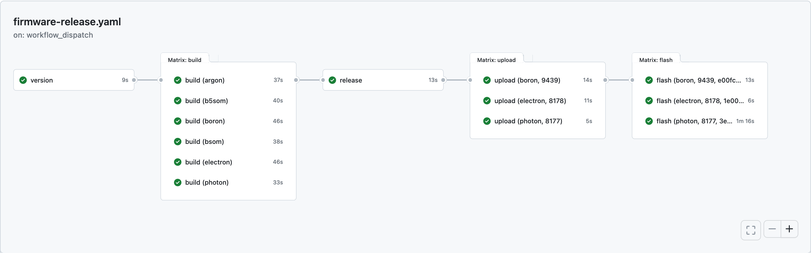

# Multiple Products

This example demonstrates how to use GitHub Actions to build and release firmware for multiple Particle products or platforms.

## Getting Started

1. Move `firmware-build.yaml` and `firmware-release.yaml` files to the `.github/workflows` directory of your Particle project repository.
1. Review the templates and customize them to your needs:
    * See `<photon-product-id>`, `<boron-product-id>`, and `<electron-product-id>` placeholders
    * See `<photon-development-device-id>`, `<boron-development-device-id>`, and `<electron-development-device-id>` placeholders
    * Review the `platform` matrix and add/remove platforms as needed
1. Set a `PARTICLE_ACCESS_TOKEN_<product_id>` secret in your repository settings _for each product_ targeted by these Actions.
   * You should use product-scoped API User tokens to authenticate with the Particle Cloud in order to limit the scope of the token to the product(s) you are building for.
     Each API User needs the `devices:update` and `firmware:create` scopes to successfully run these pipelines.
   * If your product id is `1234`, then the secret name should be `PARTICLE_ACCESS_TOKEN_1234`.
   * See [Particle docs](https://docs.particle.io/firmware/best-practices/github-actions/#obtain-an-access-token) and [GitHub docs](https://docs.github.com/en/actions/reference/encrypted-secrets#creating-encrypted-secrets-for-a-repository) for more information.
1. Commit and push the workflow files to your repository.
1. The GitHub Actions workflow will automatically start compiling your firmware upon each push to the repository. You can view the status of the workflow in the "Actions" tab of your repository.
1. When the push even occurs on the `main` branch, the compiled firmware will be flashed to the devices specified.
1. Trigger a firmware release upload by going to the Actions tab in your repository and clicking the 'Run workflow' button.
   * This won't OTA a fleet of devices. Only the development devices specified in the workflow receive OTAs. To release a new version to your fleet(s), you still need to log into the console and release the firmware to your fleet.
